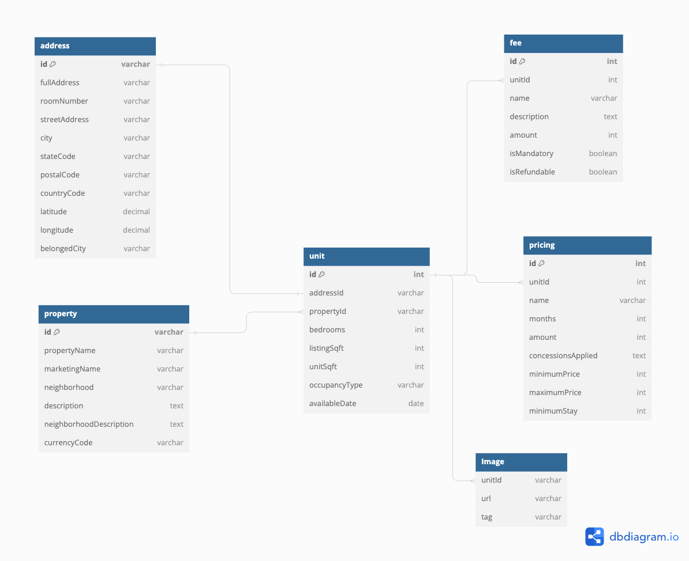

## Here's a proposed normalized schema for the given relationships:

### Entities:
- Property: Represents a rental property.
    - Attributes: id (primary key), propertyName, marketingName, neighborhood, currencyCode, description, neighborhoodDescription.
- Address: Represents the address of a rental unit within a property.
    - Attributes: id (primary key), fullAddress, roomNumber, streetAddress, city, stateCode, postalCode, countryCode, latitude, longitude, belongedCity.
- Unit: Represents a rental unit within a property.
    - Attributes: id (primary key), propertyId (foreign key referencing Property.id), addressId (foreign key referencing Address.id), occupancyType, unitSqft, bedroom, listingSqft, availableDate.
- Pricing: Represents pricing information for a unit.
    - Attributes: id (primary key), propertyId (foreign key referencing Property.id), durationMonths, amount, concessionsApplied.
- Fee: Represents fees associated with renting a unit.
    - Attributes: id (primary key), propertyId (foreign key referencing Property.id), name, description, amount, isMandatory, isRefundable.
- Image: Represents images associated with a unit.
    - Attributes: unitId, url, tag.

### Relationships:

- Each Property can have multiple Units, each identified by its unique id.
- Each Unit can have multiple Pricing options, each identified by its unique id.
- Each Unit can have multiple Fees, each identified by its unique id.
- Each Unit can have multiple Images.
- Each Address belongs to one Unit, identified by UnitId.
- Each Unit belongs to one Property, identified by propertyId, and one Address, identified by addressId.

### Schema:

The diagram visually represents the relationships between the entities in the schema. It shows how the entities are connected and the cardinality of those relationships.

()

### Rationale:
The schema is designed to support a rental property management system where various attributes and relationships are organized.
Normalization helps in reducing redundancy and ensures data integrity.
Using composite keys (e.g., addressId, id) ensures uniqueness and efficient data retrieval.
Separating Pricing and Fee into their own tables allows for flexibility and scalability in managing rental pricing and fees.

### Scalability:
If renting to businesses is introduced, additional attributes may be required to capture business-specific information such as company name, industry type, etc. This can be accommodated by extending the existing entities or adding new entities as necessary.
The schema is designed to be flexible and adaptable to future changes in business requirements without significant restructuring.

## Code Exercise

The exercise includes the following steps:
- Once the repository is cloned, Do make sure to install the packages needed to run the code.
    Execute `pip install -r requirements.txt`

- Steps in Execution of Code in `Habyt_Proposed_Schema.ipynb`:
    1. Import Packages
    2. Retrive Data from the following URL `https://www.common.com/cmn-api/listings/common`
    3. Create class definitions based on the proposed Schema
    4. Transform JSON data into object models
    5. Create CSV files from the Objects and make sure to remove any duplicated rows

- After execution of the complete script there will be following CSV files created:
    1. `properties.csv`
    2. `addresses.csv`
    3. `pricings.csv`
    4. `fees.csv`
    5. `images.csv`